<div align="center">


# Junglish

**Daily English for a Korean professional — 365 days of vocabulary, patterns and dialogue, scheduled by FSRS.**

One mission a day. Twelve minutes on a phone. No streaks to buy, no leagues, no ads.


<br />

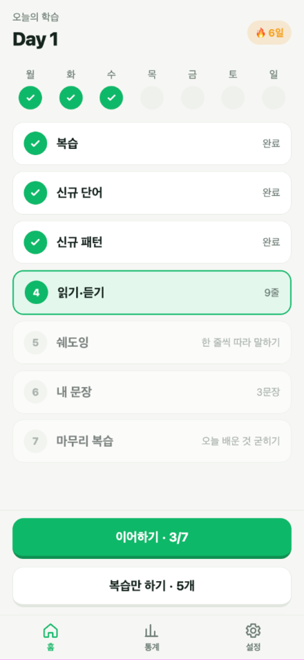
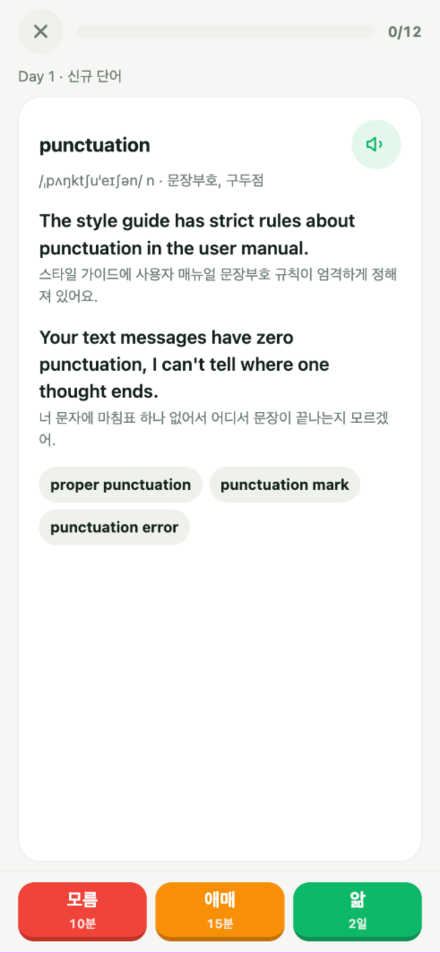
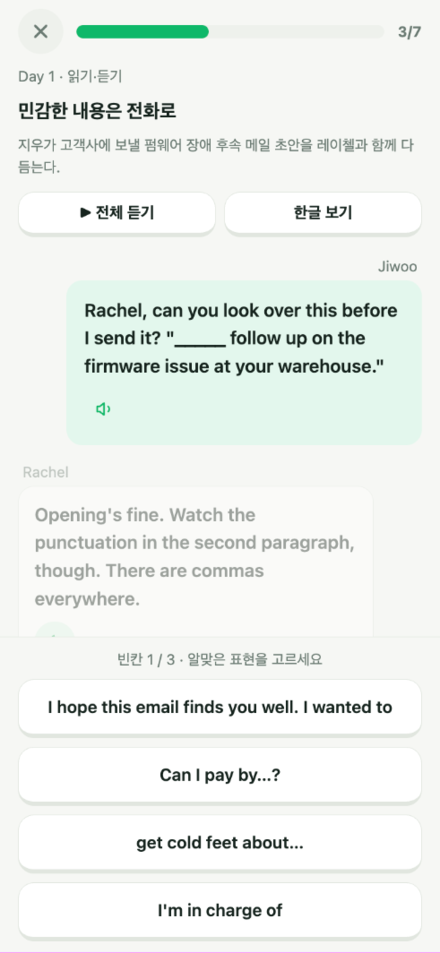
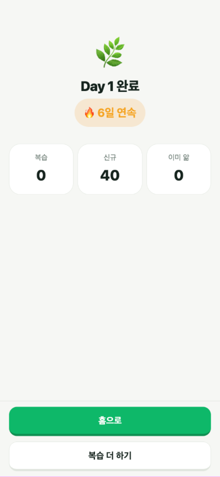

</div>

---

## The idea

Most language apps optimise for the app: leagues, gems, notifications, five-minute "lessons" that teach three words. Junglish optimises for one person — a Korean engineer who needs English that survives a customer call and a Slack thread on the same day.

So the product is deliberately small:

- **One mission per day**, always the same seven steps, always finishable in one sitting.
- **Words and phrases you don't already know** — the 2,000 most common English words are filtered out before content is generated.
- **Everything bilingual**, with Korean written the way a Korean actually speaks, not dictionary Korean.
- **Spaced repetition that you can see** — every rating button shows when the card comes back.
- **No social layer.** Your only opponent is yesterday.

---

## A day in the app

Seven steps. The home screen shows them as a path, so you always know what is left.

<table>
<tr>
<td width="25%" valign="top"></td>
<td width="25%" valign="top">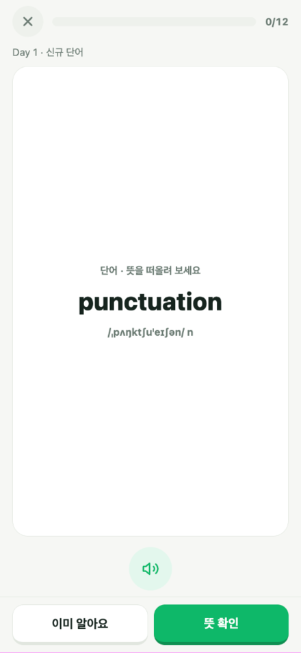</td>
<td width="25%" valign="top"></td>
<td width="25%" valign="top">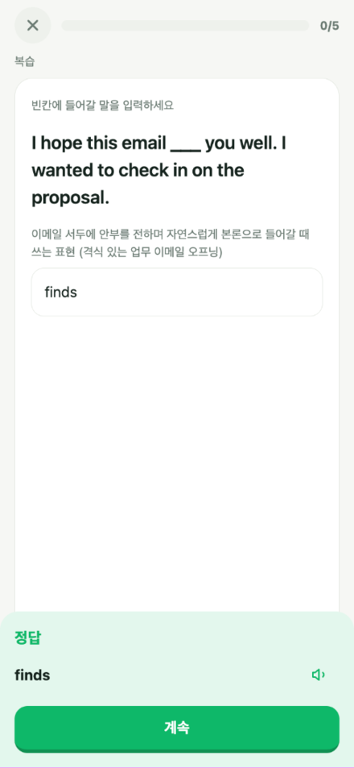</td>
</tr>
<tr>
<td valign="top"><b>Home</b><br />Weekly streak dots, the day's path with counts, and a single call to action that resumes exactly where you stopped.</td>
<td valign="top"><b>Recall first</b><br />The card shows the word alone. Audio is one tap away; the answer is never shown before you try.</td>
<td valign="top"><b>Then the evidence</b><br />Meaning, a work sentence, a daily sentence, collocations — and the interval each rating buys you (10분 / 15분 / 2일).</td>
<td valign="top"><b>Typing, later</b><br />Once a card is stable for two weeks it stops being multiple choice: you type the missing word and get a pass/fail sheet.</td>
</tr>
<tr>
<td valign="top"></td>
<td valign="top">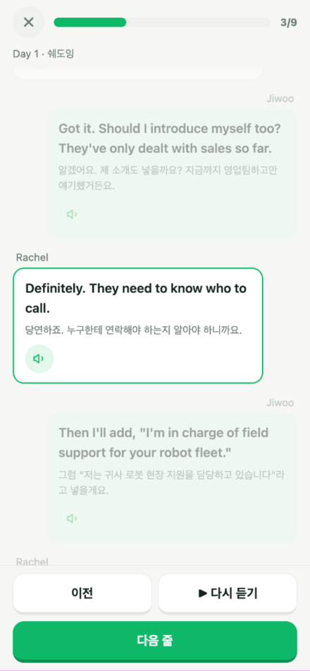</td>
<td valign="top">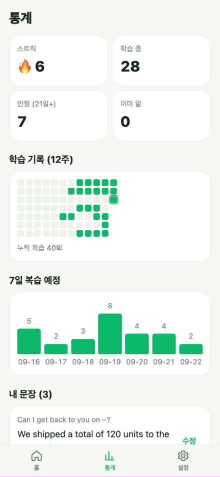</td>
<td valign="top"></td>
</tr>
<tr>
<td valign="top"><b>Dialogue</b><br />The day's words and patterns come back inside a real conversation. One blank at a time, the line in question scrolled into view.</td>
<td valign="top"><b>Shadowing</b><br />Line by line with speech synthesis. The active line is highlighted and always on screen.</td>
<td valign="top"><b>Stats</b><br />Streak, cards in learning, cards that survived 21 days, a twelve-week grid and the next seven days of review load.</td>
<td valign="top"><b>Done</b><br />What you reviewed, what was new, and the streak — then the app gets out of the way until tomorrow.</td>
</tr>
</table>

The full order: **review → new words → new patterns → dialogue → shadowing → your own sentences → final review**. Every step is a server-side state (`day_progress.step`), so closing the app mid-session loses nothing.

### Dark mode

Every colour is a token. Nothing is hard-coded, so the whole app follows the system theme.

<div align="center">
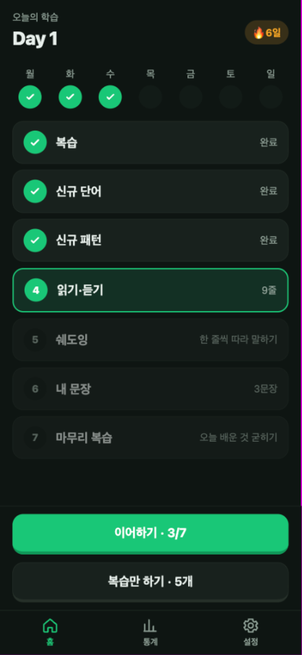
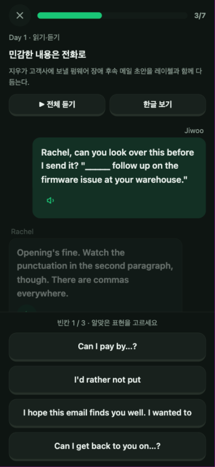
</div>

---

## Where the content comes from

The app ships with a year of material that was generated once, offline, and then frozen into a read-only SQLite file.

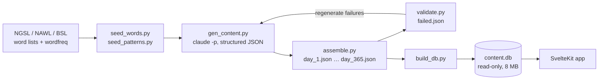

| Stage | What it does |
| --- | --- |
| **Seeding** | Words come from NGSL, NAWL and BSL. Anything inside the 2,000 most frequent NGSL words is dropped as already known; the rest is ordered by frequency so difficulty ramps across the year. Patterns are seeded by category quota — 1,250 business, 1,200 daily, 700 collocations, 500 grammar. |
| **Generation** | `claude -p` with a JSON schema per chunk: Sonnet writes 90 words or 50 patterns per call, Opus writes 10 dialogues per call. Four generator processes run on disjoint chunk ranges and skip chunks that already exist, so the run is resumable. |
| **Assembly** | Chunks are stitched into one file per day. English/Korean pairs that came back swapped are repaired automatically. |
| **Validation** | Each day is checked: does the example actually contain the word (stem and inflection aware), is the cloze answer part of the pattern, is the Korean really Korean, does the dialogue use the three patterns it was given. Failures are written to `failed.json` and regenerated. |
| **Build** | `build_db.py` writes `words`, `patterns`, `dialogues` and `quiz_items` into `content.db`. A day can be rebuilt in place without touching the rest. |

**What that produced:** 10,950 words · 3,650 patterns · 365 dialogues · 1,095 dialogue blanks · 8 MB.

Each dialogue is a two-person scene at a robotics company that reuses three of the day's patterns and five of its words, so nothing is learned in isolation.

---

## How it is built

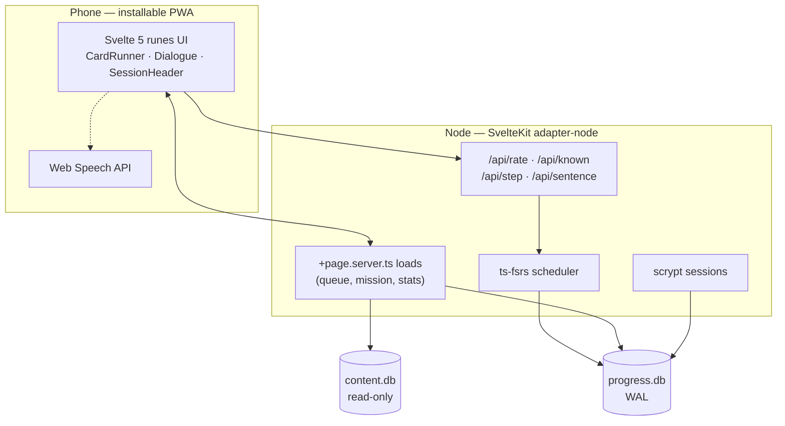

**Two databases, on purpose.** `content.db` is opened read-only and is the same file for everyone; `progress.db` holds users, sessions, card states, review logs, day progress and your own sentences in WAL mode. Content can be rebuilt or replaced without any migration of learner data.

**Scheduling** is [FSRS](https://github.com/open-spaced-repetition/ts-fsrs) with a single 10-minute learning step and 90% target retention. Three ratings only — 모름 / 애매 / 앎 — because a fourth choice on a phone is a coin flip. The same `f.repeat()` preview that FSRS uses internally is rendered under each button, so the cost of every answer is visible before you press it. Cards you mark "이미 알아요" are parked permanently and never scheduled again, and they can be un-parked from the stats tab.

**Sessions are server state.** The client never decides what comes next: `/api/step` advances `day_progress` and is idempotent, so a double tap or a flaky connection cannot skip a step or double-complete a day.

---

## Design system

Built mobile-first for one-handed use, then checked at 390×844 and 375×667.

| Token | Light | Dark | Used for |
| --- | --- | --- | --- |
| `--brand` | `#12b76a` | `#19c776` | Primary actions, progress, "앎" |
| `--brand-press` | `#0d8f52` | `#0f9758` | The pressed edge under every filled button |
| `--again` / `--hard` | `#f04438` / `#f79009` | `#ff6154` / `#ffa42b` | "모름" / "애매" and wrong answers |
| `--bg` / `--surface` | `#f5f7f4` / `#ffffff` | `#0e1512` / `#18211d` | Page and cards |
| `--ink` / `--muted` | `#16241e` / `#6b7b73` | `#e8efea` / `#8fa096` | Text |

- **Type:** Pretendard Variable (dynamic subset, ~1 request) with a system fallback stack. 800 for titles, 700 for buttons, tabular numerals for every count.
- **Buttons** are solid with a 4px darker bottom edge that collapses by 3px on press — the press is visible without a hover state.
- **Layout** is a fixed column: a scrolling `.pane` and a `.bar` pinned to the thumb zone, both padded with `env(safe-area-inset-*)`. Nothing important ever sits behind the notch or the home indicator.
- **Every session screen** has the same header: close button, rounded progress bar, counter. In a standalone PWA there is no browser back button, so an explicit exit is not optional.
- **Motion** is small and respects `prefers-reduced-motion`: a card pop, a wrong-answer shake, confetti once a day.

### Rules that came out of QA, not design

The redesign shipped together with a QA pass on the real device size. A few behaviours are deliberate:

- A failed save **keeps the card on screen** with a retry button instead of moving on — a lost rating is worse than a lost second.
- Only **one save is in flight at a time**, so double taps cannot rate one card twice and skip the next.
- Blanks in the dialogue are matched **case-insensitively**, because a sentence may capitalise a phrase that the quiz stores in lower case.
- Distractors are rendered from the stored pattern text with `~` turned into `…`, so no option leaks the answer by looking malformed.
- The writing step has **no "skip"** — one button saves whatever is filled in (including nothing), so a typed sentence is never thrown away.
- The name field is `autocapitalize="none"` and trimmed server-side; iOS was otherwise breaking logins.
- `speechSynthesis` is feature-detected, so in-app browsers without it degrade instead of crashing.

---

## Stack

| Layer | Choice | Why |
| --- | --- | --- |
| UI | SvelteKit 2, Svelte 5 runes, TypeScript | Server loads keep the client thin; no client state library needed |
| Styling | One hand-written `app.css` (~150 lines of tokens and primitives) + scoped component styles | No framework to fight on a small, opinionated UI |
| Data | SQLite via `better-sqlite3`, synchronous | Single user, single box; queries are sub-millisecond |
| Scheduling | `ts-fsrs` 5.4 | Modern FSRS, exposes interval previews |
| Speech | Web Speech API | No audio to host, works offline on device voices |
| Content | Python 3, `wordfreq`, `claude -p` with JSON schemas | Generation is a batch job, not a runtime dependency |
| Tests | Vitest (server logic, in-memory SQLite) + pytest (pipeline) | Same fixtures as production schema |
| Runtime | Node 22, `@sveltejs/adapter-node` in Docker | One container, one volume |
| Edge | Host nginx, TLS, `X-Forwarded-For` | Oracle Cloud free tier (ARM) |

**Size:** ~1,870 lines of app code (TypeScript + Svelte + CSS), ~1,140 lines of Python pipeline.

---

## Project layout

```
app/                     SvelteKit application
  src/lib/components/    CardRunner, FlipCard, TypeCard, Dialogue, SessionHeader
  src/lib/server/        db, auth, content, cards, queue, fsrs, mission, stats
  src/lib/quiz.ts        dialogue blank quiz (shared by load and UI)
  src/routes/(app)/      home, mission/[step], review, stats, settings
  tests/                 vitest suites against in-memory SQLite
pipeline/                content generation (seed → generate → assemble → validate → build)
deploy/                  Dockerfile, compose file, nginx example, sync and backup scripts
data/                    content.db (generated) and progress.db (runtime)
assets/screenshots/      the images in this README
```

## Running it locally

```bash
# 1. content database (or copy an existing data/content.db)
python3 -m venv .venv && .venv/bin/pip install -r pipeline/requirements.txt
.venv/bin/python -m pipeline.build_db

# 2. app
cd app && npm install
npm run user:add -- --name junsang     # prompts for a password
npm run dev                            # http://localhost:5173
```

```bash
npm run check    # svelte-check, 0 errors
npm test         # 43 vitest tests
cd .. && .venv/bin/python -m pytest -q pipeline/tests   # 71 tests
```

## Deploying

```bash
DEPLOY_ENV=~/.secrets.env deploy/sync.sh --build
```

`sync.sh` rsyncs the repository (without `node_modules`, `data/` or build output) to the server and rebuilds the container. The app listens on `127.0.0.1:3400`; the host nginx in `deploy/nginx.conf.example` terminates TLS and forwards. `data/` is a bind mount, so `progress.db` survives every rebuild, and `deploy/backup.sh` keeps 30 days of snapshots.

---

<div align="center">
<sub>A single-user app, self-hosted. Built with SvelteKit, FSRS and a year of content written by Claude.</sub>
</div>
